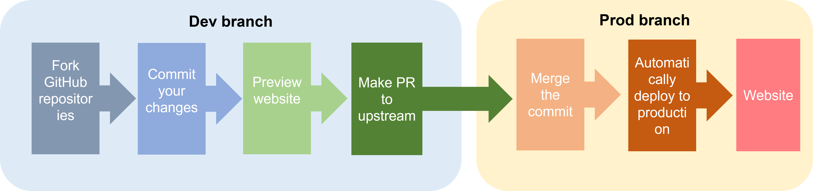

本项目为 [USTC IP Lab](https://ustc-ip-lab.github.io/) 主页的源代码仓库，请注意，本项目基于 [Hugo](https://github.com/gohugoio/hugo) 和 [Wowchemy's Research Group Template](https://wowchemy.com/templates/) 开发而成，设计理念受到博客 [《How to Build Academic Website for Research Group in 2021》](https://jedyang.com/post/how-to-build-academic-research-group-website-in-2021/) 启发。

如果本项目对您有帮助，欢迎 star、fork，这对我很重要，谢谢! ^_^

本次修改改进了部分函数的性能，调整了函数结构
对数据进行了增强
